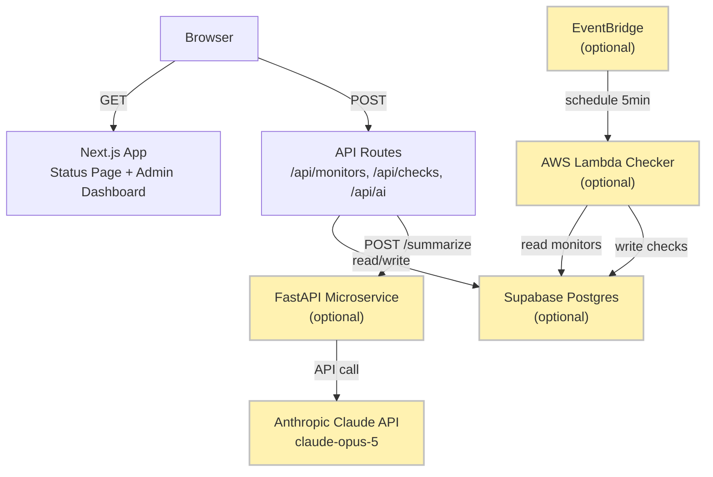

# Watchpost

[](https://github.com/frankTurtle/watchpost/actions/workflows/ci.yml)
[](LICENSE)
[](https://claude.ai)

**Self-hosted uptime monitoring with beautiful public status pages.**

Watchpost is a lightweight, open-source uptime monitor and status page system. Deploy it once to track your services, display their health publicly, and optionally add AI-powered status summaries. Works with zero external dependencies in demo mode; connect Supabase for persistence and AWS Lambda for scheduled checks.

## Features

- **Public status page** — 24-hour uptime bars per monitor, real-time overall state
- **Admin dashboard** — create, pause, and delete monitors; trigger check runs
- **Flexible checking** — on-demand checks from the dashboard, or scheduled via AWS Lambda on a 5-minute interval (configurable)
- **Basic auth** — optional admin password protection
- **AI status summaries** — one click and Claude writes a plain-English summary of monitor health on the status page
- **Demo mode** — zero configuration: `npm run dev` and go; seeded with 3 monitors and 24 hours of synthetic check data
- **Optional Supabase backend** — swap the in-memory demo for a persistent Postgres database

## Architecture



Components shown in gold are optional — the demo mode runs the core (browser, Next.js app, in-memory database) without them.

## Quickstart

No configuration needed. Clone, install, and run:

```bash
git clone https://github.com/frankTurtle/watchpost.git
cd watchpost
npm install
npm run dev
```

Open [http://localhost:3000](http://localhost:3000) in your browser. The status page loads with 3 demo monitors (Example.com, GitHub, and a flaky demo service) seeded with 24 hours of synthetic check data and 48 half-hour uptime bars.

### Requirements

- **Node.js 20+** (tested with Node 22)
- **npm** (or yarn/pnpm)

## Connect Supabase

To persist monitors and checks across restarts, connect a Supabase project.

1. **Create a Supabase project** at [supabase.com](https://supabase.com), or use an existing one.
2. **Run the schema** — in the Supabase SQL editor, paste and run the contents of `supabase/migrations/0001_init.sql`. Optionally run `supabase/seed.sql` to populate example monitors.
3. **Copy the environment variables**:
   ```bash
   cp .env.example .env.local
   ```
4. **Fill in the Supabase credentials** — from your Supabase project settings:
   - `NEXT_PUBLIC_SUPABASE_URL` — your project's public URL (e.g., `https://abc123.supabase.co`)
   - `NEXT_PUBLIC_SUPABASE_ANON_KEY` — the anonymous key (for client-side reads of the status page)
   - `SUPABASE_SERVICE_ROLE_KEY` — the service role key (for server-side API writes; never expose to the client)

5. **Restart** the dev server (`npm run dev`).

When Supabase credentials are set, the app switches from demo mode to reading and writing live data. Leave them unset to stay in demo mode.

## Protect the Admin

The admin dashboard (`/admin`) and all write APIs (create, update, delete monitors; trigger manual checks) are unprotected by default. Set an admin password to enable basic auth:

```bash
# In .env.local
ADMIN_PASSWORD=your-secure-password
```

Restart the server. Accessing `/admin` or calling write APIs will prompt for username (ignored) and password.

## AI Status Summaries

Add Claude-powered status summaries to the status page. The AI reads your monitor data and writes a plain-English summary under 120 words.

1. **Start the FastAPI service** — open a new terminal:
   ```bash
   cd services/ai
   python -m venv .venv
   source .venv/bin/activate  # On Windows: .venv\Scripts\activate
   pip install -e ".[dev]"
   export ANTHROPIC_API_KEY=sk-...  # Your Anthropic API key
   .venv/bin/uvicorn app.main:app --port 8000
   ```

2. **Configure the Next.js app** — in `.env.local`:
   ```bash
   AI_SERVICE_URL=http://localhost:8000
   ```

3. **Restart** the Next.js server. The status page will fetch summaries from the AI service.

The service uses Claude Opus 5 via the Anthropic SDK with server-side fallback enabled. It gracefully degrades when `ANTHROPIC_API_KEY` is unset: the `/health` endpoint reflects `"ai_enabled": false`, and the status page skips the summary section without errors.

## Scheduled Checks on AWS

Watchpost can run periodic uptime checks on AWS Lambda, triggered by EventBridge every 5 minutes (configurable). See [infra/README.md](infra/README.md) for full setup details.

**Quick summary:**

```bash
cd infra/terraform
cp terraform.tfvars.example terraform.tfvars
# Edit terraform.tfvars with your Supabase URL and service role key
terraform init
terraform plan
terraform apply
```

Terraform provisions the Lambda function, EventBridge rule, and CloudWatch logs. The checker is ~free under the AWS free tier (128 MB memory, ~8,640 invocations/month). Monitor logs in CloudWatch or via the AWS CLI:

```bash
aws logs tail /aws/lambda/watchpost-checker --follow
```

To clean up: `terraform destroy`.

## Testing

### Web app (Next.js)

```bash
npm run test:coverage
```

Runs Vitest with v8 coverage reporting. The test suite enforces **90% line coverage** on `lib/` (business logic: status calculation, data providers) and api routes. CI runs this on every PR.

### AI service (FastAPI)

```bash
cd services/ai
python -m pytest
```

Runs pytest with coverage reporting. Enforces **90% line coverage** on the `app/` package. CI runs this on every PR.

Coverage gates run automatically in CI (`.github/workflows/ci.yml`), so a green check means both thresholds passed.

## Stack

- **Web framework** — Next.js 16 (App Router, TypeScript)
- **Styling** — Tailwind CSS v4, DaisyUI 5
- **Database** — Supabase (PostgreSQL, optional)
- **Scheduled checks** — AWS Lambda + EventBridge (optional)
- **AI summaries** — FastAPI + Anthropic Claude API (optional)
- **Testing** — Vitest (web) + pytest (AI service), 90% coverage gates
- **CI** — GitHub Actions (lint, build, test, terraform validate)

## How This Repo Was Built

Watchpost is a demonstration of **AI-assisted engineering workflow**. The project was pair-built by a human and Claude using Claude Code (Anthropic's official CLI), with a team of specialized AI coding agents, one feature branch per agent.

The development process follows:
- **GitFlow branching model** — feature branches off `develop`, merged by PR; a release branch cut from `develop` lands on `main` with a version tag
- **Conventional commits** — every commit is prefixed with type (`feat`, `fix`, `docs`, `test`, `ci`, `chore`) and co-authored with `Co-Authored-By: Claude`
- **Code review** — each feature branch is merged via pull request with CI gates (lint, build, test, coverage)

This approach demonstrates how AI agents can collaborate on a real-world codebase while maintaining traceability, quality gates, and human oversight.

## Contributing

See [CONTRIBUTING.md](CONTRIBUTING.md) for setup, branch model, and code style guidelines.

## License

MIT. See [LICENSE](LICENSE).
